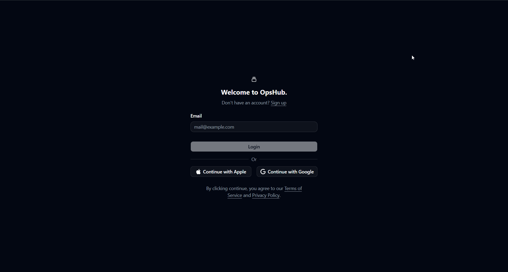
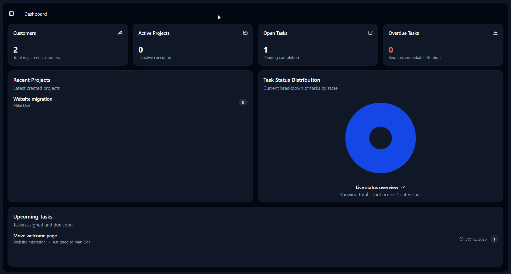

# OpsHub

[](https://dotnet.microsoft.com/)
[](https://angular.dev/)
[](https://www.microsoft.com/sql-server)
[](https://github.com/Ethern-Myth)
[](https://kubernetes.io/)

> **Engineered & Architected by [Ethern-Myth](https://github.com/Ethern-Myth)**  
> *A high-performance enterprise operations management platform built with uncompromising architectural rigor, zero-trust security, and cloud-native resilience.*





---

## Executive Summary

**OpsHub** is a production-grade operations management ecosystem engineered for modern enterprise scale. Conceived and architected from day one to eliminate operational friction, OpsHub pairs an ultra-responsive, signal-driven **Angular** frontend with a high-throughput, modular **.NET** backend running on **SQL Server**.

Every tier of OpsHub demonstrates architectural maturity: from strict Clean Architecture boundaries and dynamic role-based access control (RBAC), to end-to-end Cross-Site Request Forgery (CSRF) defense, distributed cryptographic key persistence, and automated Kubernetes canary delivery.

---

## System Topology & Architecture

OpsHub adheres to the **Clean / Onion Architecture** paradigm, ensuring that business rules remain completely decoupled from transport protocols, external dependencies, and persistence engines.

```
                      ┌─────────────────────────────────────────┐
                      │             Angular Client              │
                      │  (Signals • AppShell • Lazy Subtrees)   │
                      └────────────────────┬────────────────────┘
                                           │  HTTPS / REST / XSRF Handshake
                                           ▼
                      ┌─────────────────────────────────────────┐
                      │          NGINX / Ingress Router         │
                      │       (SSL Offload • Canary Rules)      │
                      └────────────────────┬────────────────────┘
                                           │
         ┌─────────────────────────────────┴─────────────────────────────────┐
         ▼                                                                   ▼
┌─────────────────────────────────┐                         ┌─────────────────────────────────┐
│           Presentation          │                         │     Application & Security      │
│  Controllers • Transformers     │ ── (DTOs & Commands) ── │ Dynamic RBAC • Business Logic   │
│  OpenAPI / Swagger Pipeline     │                         │ Reactive Token Orchestration    │
└────────────────┬────────────────┘                         └────────────────┬────────────────┘
                 │                                                           │
                 ▼                                                           ▼
┌─────────────────────────────────┐                         ┌─────────────────────────────────┐
│         Infrastructure          │                         │          Core Domain            │
│ SQL Server Persistence (EF)     │ ── (Entity Mapping) ─── │ Plain Domain Entities & Enums   │
│ Data Protection Key Management  │                         │ Zero Third-Party Dependencies   │
└─────────────────────────────────┘                         └─────────────────────────────────┘
```

### Architectural Highlights

| Tier | Technology | Key Architectural Patterns |
| :--- | :--- | :--- |
| **Frontend** | **Angular** | Standalone Component Topology, Fine-Grained Signal Stores, Reactive Route Guards, Silent JWT Interceptor Queuing |
| **Backend** | **.NET** | Clean Architecture (Domain, Application, Infrastructure, API), Dynamic Policy Providers, RFC 7807 Global Exception Handling |
| **Database** | **SQL Server** | Code-First Fluent Configurations, Idempotent Migrations, Strict Relational Constraints, Principle of Least Privilege User Roles |
| **DevOps** | **Docker & Kubernetes** | Multi-Stage Builds, NGINX Reverse Proxy, Distributed Data Protection Volume Mounts, Canary Ingress Traffic Shifting |

---

## Technical Excellence & Engineering Patterns

### 1. Dynamic, Granular Permission-Based Authorization
Rather than relying on static, compile-time roles, OpsHub implements a dynamic, claims-driven authorization engine:
* **Custom Policy Provider**: A dedicated `IAuthorizationPolicyProvider` resolves permissions dynamically on demand via a declarative prefix strategy (`Permission:<permission>`), eliminating boilerplate policy registrations.
* **Fine-Grained Permission Handlers**: Permissions are evaluated at runtime against user claims, enforcing precise privileges (`customers.view`, `customers.create`, `projects.update`, etc.) per action.
* **Synchronized Route Protection**: Angular functional guards mirror the backend authorization model, validating user permission sets prior to rendering route subtrees.

### 2. Defense-in-Depth Security Posture
* **Cross-Site Request Forgery (CSRF/XSRF) Shield**: Automatic token validation for all state-mutating HTTP methods (`POST`, `PUT`, `DELETE`). The backend provides an antiforgery token handshake endpoint, while the Angular interceptor pipeline seamlessly attaches the token to outgoing requests with secure credential transport.
* **Concurrency-Safe Silent Token Refresh**: The Angular HTTP interceptor pipeline incorporates an asynchronous lock and reactive queue. Concurrent requests arriving during an active refresh cycle are paused and automatically replayed with the new access token, preventing cascading 401 storms.
* **Token Hardening & Revocation**: Configured for short-lived access tokens, refresh token rotation, active replay detection, and user token blacklisting.
* **Persistent Cryptographic Key Ring**: ASP.NET Data Protection keys are persisted to dedicated, volume-backed storage (`/app/dp-keys`), ensuring authentication tickets and encrypted cookies survive container restarts, rolling updates, and multi-replica cluster scaling.

### 3. Efficiency & Reliability
* **End-to-End Async Cancellation**: Every controller endpoint and service layer method propagates `CancellationToken` directly to SQL Server queries, immediately aborting execution and reclaiming database resources if a client disconnects.
* **Deterministic RFC 7807 Error Handling**: A centralized global exception handler captures domain and infrastructure errors, translating them into standardized `ProblemDetails` responses while masking internal database and infrastructure details from callers.
* **Signal-Driven State Architecture**: The client leverages fine-grained Angular signals to eliminate unnecessary component tree re-renders and deliver instant UI responsiveness.

---

## Cloud-Native Infrastructure & Canary Deployments

OpsHub is designed for high availability and zero-downtime progressive rollouts:

```
                            [ Ingress Controller ]
                                       │
                      ┌────────────────┴────────────────┐
             Weight: 90%                       Weight: 10%
                      ▼                                 ▼
             [ Production: v1 ]                 [ Canary: v2 ]
```

* **Zero-Downtime Traffic Splitting**: Production Kubernetes ingress configurations define explicit canary rules (`canary-weight: "10"`), allowing new versions to be safely validated against production workloads before full promotion.
* **State & Data Protection Decoupling**: Persistent Volume Claims (PVC) isolate stateful cryptographic keys and mail storage from ephemeral application pods.
* **Automated Reverse Proxy & SSL**: NGINX acts as the unified reverse proxy, managing HTTPS termination, header forwarding, and proxy contracts between client and API containers.

---

## Directory Structure

```text
opshub/
├── web/                               # Angular Single Page Application
│   ├── src/
│   │   ├── app/
│   │   │   ├── core/                  # Interceptors, guards, stores, API clients
│   │   │   ├── features/              # Self-contained domain modules
│   │   │   │   ├── auth/              # Authentication & registration workflows
│   │   │   │   ├── dashboard/         # Real-time analytics & telemetry
│   │   │   │   ├── customers/         # Customer lifecycle management
│   │   │   │   ├── projects/          # Project tracking & delivery
│   │   │   │   ├── tasks/             # Task scheduling & workflows
│   │   │   │   ├── permissions/       # Fine-grained permission assignments
│   │   │   │   └── user/              # User administration & role mapping
│   │   │   └── layout/                # Shell, navigation, dynamic header/sidebar
│   │   └── ssl/                       # Local development SSL certificates
│   ├── Dockerfile                     # Multi-stage production web container
│   └── nginx.conf                     # Client reverse proxy & security headers
│
├── server/                            # .NET Enterprise Clean Architecture Solution
│   ├── Domain/                        # Pure enterprise entities, value objects & enums
│   ├── Application/                   # Application contracts, DTOs, interfaces & logic
│   ├── Infrastructure/                # SQL Server persistence, EF configurations, security
│   ├── server/                        # API presentation host, dynamic RBAC, OpenAPI setup
│   ├── kube/                          # Kubernetes deployments, services & canary ingress
│   └── docker-compose.yml             # Local multi-service orchestration
│
├── scripts/                           # SQL provisioning & database initialization scripts
└── COMMANDS.md                        # Operational CLI guide for EF, Docker & Kubernetes
```

---

## Quick Start

### Prerequisites
* **.NET SDK** (Version 10+)
* **Node.js** (LTS)
* **SQL Server**
* **Docker & Kubernetes CLI** (Optional, for containerized deployments)

### 1. Database Provisioning & Migrations
Provision the database user and apply idempotent migrations:
```bash
# 1. Initialize user and grant permissions
sqlcmd -S localhost -i scripts/create_user_for_db.sql

# 2. Apply Entity Framework Core database migrations
dotnet ef database update --project server/Infrastructure --startup-project server/server
```

### 2. Launch the Backend API (.NET)
```bash
cd server/server
dotnet run
```
*API Swagger & OpenAPI documentation will be accessible at: `https://localhost:5000/swagger`*

### 3. Launch the Web Client (Angular)
```bash
cd web
npm install
npm start
```
*Web dashboard will be accessible at: `https://localhost:4200/`*

### 4. Containerized Execution (Docker Compose)
To launch the entire platform stack (Web, API, Ingress, and Mail services):
```bash
cd server
docker compose up -d --build
```

---

## Quality & Verification

OpsHub enforces high software quality standards across all layers:
* **Frontend Test Suite**: Component, store, and service-level verification executed via Angular's test runner:
  ```bash
  cd web && npm test
  ```
* **Database Migration Scripts**: Idempotent SQL generation for continuous integration validation:
  ```bash
  dotnet ef migrations script --idempotent --project server/Infrastructure --startup-project server/server
  ```

---

## Engineering Craft

OpsHub was designed and developed by **[Ethern-Myth](https://github.com/Ethern-Myth)** as a showcase of clean code craft, cloud-native operational readiness, and enterprise engineering best practices.
